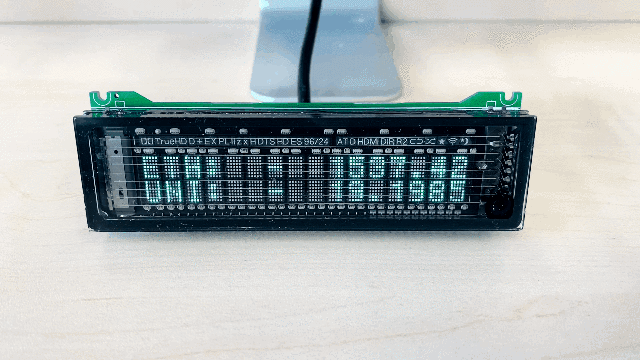

# Cyberpunk Display

Show Bitcoin(crypto) prices using [Nixie tube](https://en.wikipedia.org/wiki/Nixie_tube), [Awtrix](https://github.com/awtrix) or [VFD](https://en.wikipedia.org/wiki/Vacuum_fluorescent_display) display technologies, as desktop decors.

This repo is a mixed rust/python project, utilizing [maturin](https://github.com/PyO3/maturin).

## How to install

1. Make sure `python` and `cargo` accessible from command line
2. `git clone https://github.com/WestXu/cyberpunk_display --depth=1 && cd cyberpunk_display`
3. Install [maturin](https://github.com/PyO3/maturin). Then `maturin develop --release && pip install -e .`

## Demo
### nixie

`cyberpunk_display nixie`

### matrix

`LOGURU_LEVEL=CRITICAL cyberpunk_display matrix`

### awtrix

`cyberpunk_display awtrix --ip=localhost --port=7000`

### vfd

`cyberpunk_display vfd`

