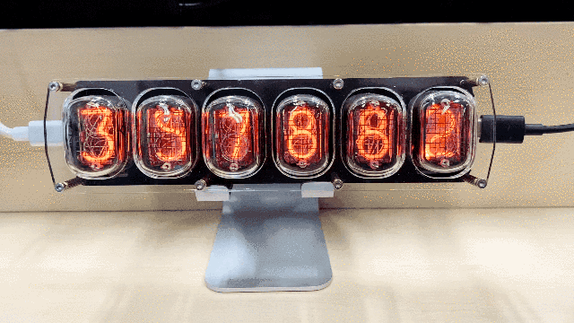
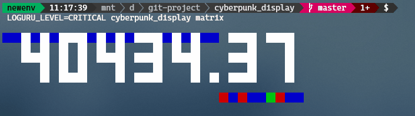
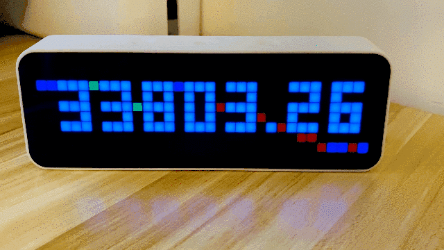

# Cyberpunk Display

[](https://hub.docker.com/r/westxu/cyberpunk_display)

Show Bitcoin(crypto) prices using [Nixie tube](https://en.wikipedia.org/wiki/Nixie_tube), [Awtrix](https://github.com/awtrix) or [VFD](https://en.wikipedia.org/wiki/Vacuum_fluorescent_display) display technologies, as desktop decors.

## Usage

### nixie

`cyberpunk_display nixie`



#### Run in background (macOS)

`task install-nixie` builds the binary into `~/.cargo/bin`, generates a
LaunchAgent plist from `launchd/nixie.plist.in` and loads it. The process
then starts at login and keeps running: unplugging the dock just pauses it
in a wait loop, plugging back in lights the tube up again within a couple
of seconds.

`task uninstall-nixie` removes the three things the install added to the
system: the loaded launchd job, the plist in
`~/Library/LaunchAgents`, and the binary in `~/.cargo/bin`. It leaves
`tmp/` (logs) and `target/` (build artifacts) alone — clean those yourself
with `git clean` / `cargo clean` if wanted.

Check status and logs:

```sh
launchctl print gui/$(id -u)/com.westxu.cyberpunk-display-nixie
tail -f tmp/logs/*.log
```

To debug in the foreground, stop the background service first so it
doesn't fight over the serial port:

```sh
launchctl bootout gui/$(id -u)/com.westxu.cyberpunk-display-nixie
# or: task uninstall-nixie
```

### matrix

`cyberpunk_display matrix`



### awtrix

`cyberpunk_display awtrix --host=localhost --port=7000`

https://user-images.githubusercontent.com/25974092/185595353-fcde4146-103b-4b02-9370-6fa9b75f7d07.mp4


